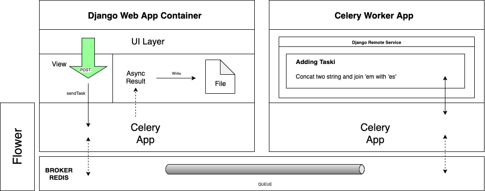

# django-redis-celery
Code example to communicate two different Django Projects through redis as Broker and Celery as Task Runner

 

To run the project and launch all containers type:  

<b>docker-compose up</b>
 

Here is a diagram with overall process involving all the components.

   

 
  <h2>How does it work?</h2>
  
   
  
User opens the django web app by going to http://localhost:8000, you must fill both text input fields with random text. Hitting the submit button it will post the data to the views.py file and post action. After validating the form data, it will use the app.send_task() method and invoking the 'adding_taski' task by passing the string parameters.

We store the result in a variable which will be used later to fetch the task result.

At this point Celery received the message and routed it to a queue. In the other side the remote service app has been loaded by celery as a worker by executing this command in the docker-compose.yml file, worker container:
 
celery -A redis_celery worker -l info
 
Celery will look for the requested task using the "auto_discover_tasks" method, and it will execute it passing it the parameters entered in the web app UI form. 
 
The task will concatenate both string parameters by joining then using the 'es' string in the middle and returns the result.
 
The result will be sent to the queue again as an "async_result" ready to be fetched by the producer which in this case is the web app.
 
To wait the result the web app uses a while loop and holds until the task result "ready" state is reached.
 
Once the result is retrieved it will open a file and writes to it.

